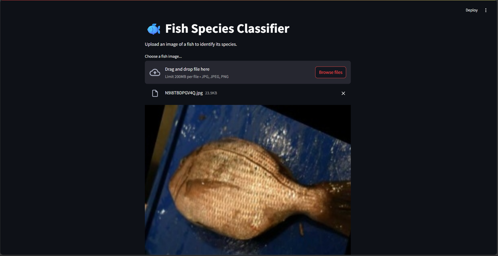
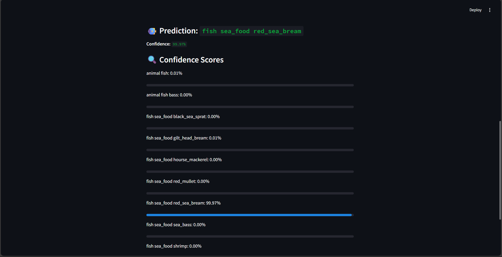

# Multiclass-Fish-Image-Classification

# 🐟 Fish Species Classifier (11 Classes)

This project builds a fish image classification system using deep learning (CNN with transfer learning). It includes a web app for interactive predictions via Streamlit.

---

## 🚀 Features

- Trained CNN model (MobileNetV2)
- 11 fish species classification
- Image preprocessing and augmentation
- Accuracy, precision, recall, F1-score evaluation
- Confusion matrix and training plots
- Deployable Streamlit app

---

## 📁 Dataset Structure
dataset/
├── train/
├── val/
└── test/

 TO DOWNLOAD THE DATA 
 https://drive.google.com/drive/folders/1iKdOs4slf3XvNWkeSfsszhPRggfJ2qEd?usp=sharing

Each folder should contain subfolders for each fish class, with images inside.

---

## 🛠️ Model Training

All training code is in [`notebooks/training_and_evaluation.ipynb`](notebooks/training_and_evaluation.ipynb).

- **Model:** MobileNetV2 (pre-trained)
- **Image Size:** 160x160
- **Epochs:** 10 (EarlyStopping used)
- **Augmentation:** rotation, zoom, flipping, shifts

---

## 📊 Model Evaluation

- Accuracy: `XX.XX%`
- Precision, Recall, F1-score per class
- Confusion Matrix:


---

## 📈 Training History


---

## 🌐 Streamlit App

Run the fish classifier locally:

```bash
cd app/
streamlit run app.py


## 📊 Streamlit APP 
Here is the Streamlit Interface:



---

## 📈 PREDICTION



